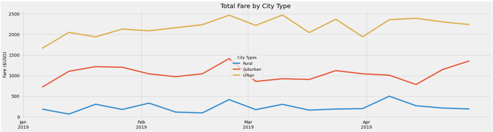

# PyBer with Matplotlib

## Project Overview

V. Isualize has requested to have a new data frame created that shows summary information of the ride-sharing data by city type. Then, a line chart showing the total weekly ride-sharing fares for each city type will be created using the summary data frame.

## Resources

- Data Source: city_data.csv, ride_data.csv
- Software: Python 3.7.11, Jupyter Notebook 6.4.5

## Results

Looking at the data, one can see that ride data for urban cities shows the largest amount of total rides at 1,625 with a total driver count of 2,405. Urban cities also had the largest amount of total fares at $39,854.38, with an average fare of $24.53 per ride and average fare per driver of $16.57. The average fare per ride and average fare per driver for Urban cities were the lowest amongst the three city types. Meanwhile, suburban cities were very much in the middle. This city type had less rides, drivers, and revenue, but also higher average fares per ride and per driver. Lastly, rural cities had the lowest number of rides at 125 with just 78 drivers. Rural cities also had the lowest total fare revenue of $4,327.93 and the highest average fares- $34.62 per ride and $55.49 per driver. See below for an image of the data gathered along with a line graph showing total fares by city type per week.

## Summary

Urban cities had the largest total fare revenue by far, beating out suburban cities by more than $20,000. Fare costs were also lower on average due to the high number of drivers available. It might be in the CEO's favor to create incentives for people to sign up as drivers in suburban and rural areas to bring consumer costs down. This will likely lead to an increase in total rides as it then becomes a more affordable transportation option. To incentivize people to sign up as drivers, sign-up bonuses and higher wages for suburban and rural drivers might be an option. One could also run promotions, offering special deals for consumers in suburban and rural areas.
